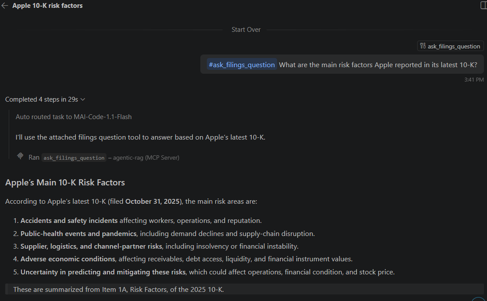

# Agentic RAG Platform — SEC Filings Q&A

A production-style agentic RAG system that answers questions about companies using their official SEC EDGAR filings (10-K reports). It has a LangGraph agent, a semantic cache, guardrails and an evaluation harness, runs on free-tier infrastructure, and is exposed as an **MCP server** so AI agents like **GitHub Copilot** can call it as a tool.

**Live API:** [agentic-rag-platform-ttsx.onrender.com/docs](https://agentic-rag-platform-ttsx.onrender.com/docs)
*(free tier, so the first request may take ~1 minute while the server wakes up)*

---

## Demo: GitHub Copilot calling this API as a tool



Copilot picks the `ask_filings_question` tool, sends the question to the live server, and answers from Apple's latest 10-K (filed 31 Oct 2025).

---

## How it works

```
Question
   │
   ▼
LangGraph router ──(small talk)──► direct answer
   │
   │ (needs filings)
   ▼
Semantic cache ──(similar question seen before)──► cached answer
   │
   ▼
Retrieval (Qdrant + BGE embeddings, re-ranked toward the latest filing)
   │
   ▼
LLM answer (Groq) with filing sources
```

| Layer | What it does | Tech |
|---|---|---|
| Ingestion | Downloads 10-K filings from SEC EDGAR, cleans HTML, splits into chunks | Python, SEC EDGAR API |
| Retrieval | Embeds chunks and finds the most relevant ones; boosts the newest filing per company | Qdrant (embedded), fastembed `bge-small-en-v1.5` |
| Agent | Decides whether a question needs filings at all before answering | LangGraph |
| Cache | Returns a stored answer when a new question is ≥0.95 similar to a past one | Qdrant, cosine similarity |
| Guardrails | Two stages: fast rule-based check + LLM semantic check, plus PII redaction | Python, Groq |
| Evaluation | LLM-as-judge scores for faithfulness, answer relevancy and context precision | Groq |
| API | REST endpoint `/ask` returning the answer and its sources | FastAPI, Render |
| MCP | Exposes `/ask` as the MCP tool `ask_filings_question` at `/mcp` | fastapi-mcp |

---

## Use it in GitHub Copilot (MCP)

1. In VS Code, create `.mcp.json` in your project folder:

```json
{
  "mcpServers": {
    "agentic-rag": {
      "url": "https://agentic-rag-platform-ttsx.onrender.com/mcp",
      "type": "http"
    }
  }
}
```

2. Click **Start** above `"agentic-rag"` and wait for **Running | 1 tools**.
3. In Copilot Chat (Agent mode), ask:

```
#ask_filings_question What are the main risk factors Apple reported in its latest 10-K?
```

---

## Call the API directly

```bash
curl -X POST https://agentic-rag-platform-ttsx.onrender.com/ask \
  -H "Content-Type: application/json" \
  -d '{"question": "What are Apple'\''s main risk factors?"}'
```

The response contains `answer`, `sources` (ticker, form, filing date, score), `used_retrieval` and `from_cache`.

---

## Run locally

```bash
git clone https://github.com/ashmitkaur28/agentic-rag-platform.git
cd agentic-rag-platform
pip install -r requirements.txt
# put GROQ_API_KEY=your_key in a .env file
uvicorn api.main:app --reload
```

Search the index without the LLM:

```bash
python retrieval/build_index.py --query "What are Apple's main risk factors?" --top-k 8
```

---

## Key decisions and lessons

- **fastembed instead of PyTorch:** PyTorch pushed memory past Render's 512 MB free tier and the server was killed (exit 137). fastembed runs on ONNX and uses far less memory.
- **Embedded Qdrant with one shared client:** local mode locks its storage folder, so the code reuses a single client to avoid lock errors.
- **Freshness re-ranking:** search returned a mix of 2024 and 2025 reports. Over-fetching 4× and giving the newest filing a small score bonus made 7 of the top 8 results come from the latest 10-K.
- **Cache kept out of Git:** the answer cache was being deployed with the code, so old answers came back even after retrieval fixes. It is now in `.gitignore`.
- **Router before retrieval:** the agent skips search for small talk, which saves LLM and search calls.

## Next steps

- Filter boilerplate chunks (website notices, stock tables) when indexing
- Add more companies and a larger evaluation set